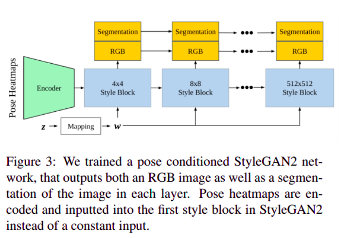
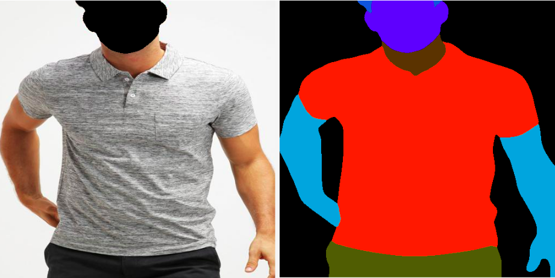
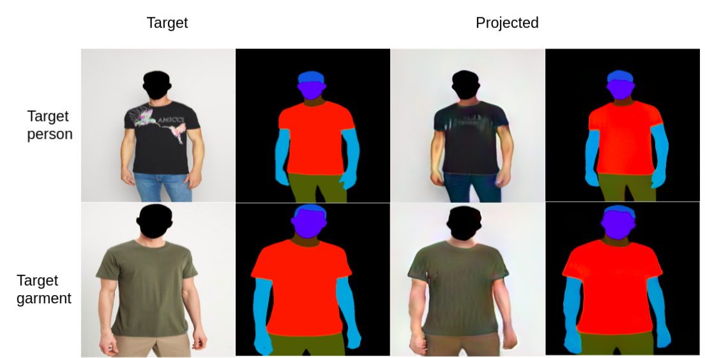
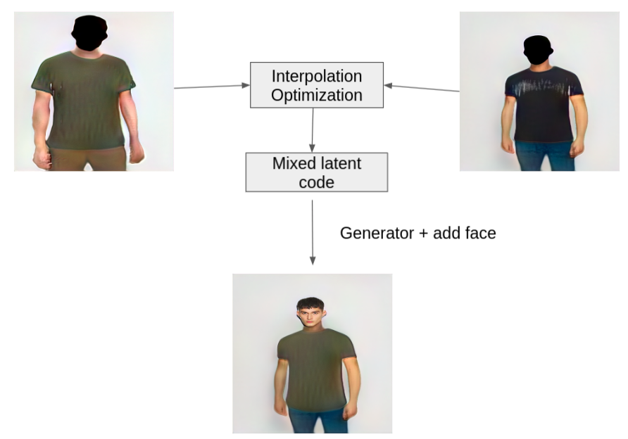

# VOGUE: Try-On by StyleGAN Interpolation Optimization

This is an attempt of pytorch implementation of the paper [VOGUE](https://vogue-try-on.github.io/). As we faced many ambiguities in the paper, this repository may not match the exact work claimed on the paper. 

**Goal:** Given a pair of images-target person and garment on another person this approach generates the target person in the given garment. 

# Network architecture:
The network archtecture is implemented as shown in the paper. Below image is extracted from the [paper](https://arxiv.org/abs/2101.02285)

We used official [StyleGAN2-ADA](https://github.com/NVlabs/stylegan2-ada-pytorch) as the base StyleGAN2 implementation.

**To train your network:**

`python train.py  --outdir=training-runs --data=<data_root_dir> --gpus=1 --cfg=vogue --mirror=1 --snap=1 --aug=noaug`

*data_root_dir contains images, keypoints, masks*

**Projection:**

To obtain the latent code of any image use [projector_vogue.py](projector_vogue.py) and check the argparse parameters

**Style mixing:**

To perform any style mixing experiment use [style_mixing_vogue.py](style_mixing_vogue.py) and check the argparse parameters

# Dataset
We collected 25000 male images wearing t-shirts or shirts. For all training images 18 pose keypoints were obtained using [Openpose](https://github.com/CMU-Perceptual-Computing-Lab/openpose). Ground truth segmentation masks were obtained using [Part-Grouping-Network](https://github.com/Engineering-Course/CIHP_PGN) and further mapped to VOGUE labels. Refer to [the mapping script](vogue_labels.py) from CIHP to VOGUE labels. Face details are masked in RGB image to make training easier. RGB and corresponding segmentation are resized to 512X512 and concatenated channel wise.

# Pose conditioned StyleGAN2 results

# Interpolation Optimization
To transfer cloth from one person to another their latent codes are interpolated and the optimal latent code is found through an iterative optimization procedure.
- get the latent codes using [projector_vogue.py](projector_vogue.py)
- run python [main_latent.py](Interpolation/main_latent.py) and change the parseargs as required.

#### Projection of Person and Garment

#### Interpolation of Person and Garment

# Checkpoint
- model weights can be downloaded [here](checkpoints/)

